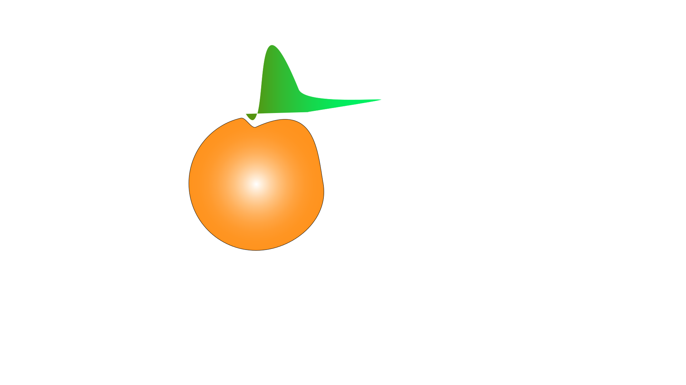

# carby

[]()
[]()
[]()

<br />
<p align="center">
  <a href="https://github.com/othneildrew/Best-README-Template">
    
  </a>
</p>


## About The Project
React-Redux based nutrition tracker

### Built With
  * [Node](https://nodejs.org/en/)
  * [JQuery](https://jquery.com)
  * [Webpack](https://webpack.js.org/)
  * [Animate.css](https://daneden.github.io/animate.css/)
  

### API's used
[]()
  * [EDAMAM](https://developers.themoviedb.org)
  
## Getting Started
Make Sure You have npm and Node isntalled as well as new api keys, then:
1.Clone the Repo:
```sh
  git clone https://github.com/koticcat/WhatToWatch-git
```
2.Install npm packages:
 ```sh
  npm install
``` 
3.Change the API keys to your API keys in the /model/getmovie.js file.

4.Run the webpack script, to lauch the app in the localhost
 ```sh
  npm run start
``` 
5.To bundle the js files and build the dist folder, use script
 ```sh
  npm run build 
```
 OR 
  ```sh
  npm run dev
```
for bypassing webpack optimization

## License

Distributed under the MIT License. See `LICENSE` for more information.


